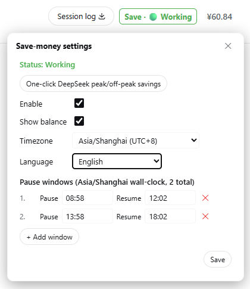
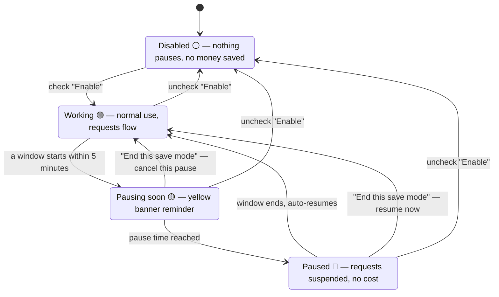

# dsh-save-money

**Save-money plugin** for DSH (DeepSeek Harness) — define your own "pause / resume" time windows; at pause time running long tasks are **paused** (not stopped) automatically, and they resume when the window ends. Built for LLM API **peak/off-peak pricing** (e.g. DeepSeek peak hours 9:00–12:00, 14:00–18:00 Beijing time, off-peak at half price), and equally useful for time-of-use electricity rates, bandwidth off-peak shifting, or any "I don't want the machine working during this period" scenario.

> Status: ✅ Implemented, continuously maintained. [中文版](./README.zh.md)

## Interface



The colored status text in the top-right of the session header (Save · ⚪/🟢/🟡/🔴, color follows the state) is the single persistent entry — click it to open the settings popover. When a pause is upcoming or active, a reminder banner appears at the top of the page (with the **End this save mode** button).

## Features

- **Multiple time windows**: add / remove pause-resume windows freely; supports midnight-crossing windows (23:00–08:00) and per-weekday filtering;
- **Automatic pause on schedule**: when the pause time arrives, running tasks are safely "frozen" (their progress is preserved exactly — nothing is interrupted or lost) and resume automatically when the window ends; **if nothing is running, nothing is paused**;
- **No requests during the window (the saving core)**: inside a pause window the AI sends no new requests to the model service, so **no cost is incurred**; after the window ends (or on disable / end-this-window) everything resumes, with conversation context and in-flight tasks unaffected. **The AI not replying inside a window (including new conversations) is expected** — to resume right away, click the **End this save mode** button (takes effect directly, no AI involved);
- **End this save mode (one-shot, current window only)**: the banner and settings-popover button end the **currently active** pause window only — if paused, tasks resume immediately and the gate opens; if a pause is upcoming, it is cancelled. The window is skipped until its resume time, then the state clears automatically. The **next window (today or later) still takes effect**, and the persistent **Enable** flag is never touched, so you cannot accidentally leave the feature disabled;
- **UI reminders**: top floating banner (light yellow for upcoming pause / light red for paused, with the **End this save mode** button) + the single persistent session-header entry (next to the Session log, "Save · 🟢 Working" colored status text; click to expand settings), colors follow the state in real time;
- **Timezone support**: IANA timezone dropdown, browser auto-detection with Beijing time (+8) fallback; UTC projection checked (Beijing 09:00 == UTC 01:00);
- **One-click DeepSeek preset**: dedupe-append the peak windows (**08:58–12:02, 13:58–18:02**, with a 2-minute boundary margin — pause 2 min early, resume 2 min late); it does **not** auto-enable — your call; legacy no-margin windows are upgraded automatically on one-click;
- **Persistent config**: all settings are saved automatically to the workspace file `save-money.config.json` (gitignored); configuration survives browser refresh and plugin disable/re-activate, and is loaded on startup with optional reconciliation of paused goals;
- **Non-intrusive by design**: no screen lock, no overlay blocking, no user action prevented — only the automatic continuation of goals is paused; manual interaction always flows.

## How it works



- When a pause window starts, running tasks are frozen (progress preserved) and the AI stops replying — that is normal: the machine is saving you money. Everything resumes automatically when the window ends;
- See the yellow "pause in X min" banner but don't want to pause right now? Click **End this save mode** to cancel this window only;
- Paused and want to continue immediately? Click **End this save mode** (red button) — it resumes right away, skips only the current window, and never turns off **Enable**: the next window (today or later) still saves money as usual. If you ever want every window to take effect again, uncheck and re-check **Enable**.

---

## Install

The official DSH plugin form is a **module exporting `apply` + cordis.yml mounting** (see the [DSH official tutorial](https://github.com/deepseek-ai/deepseek-harness/blob/main/docs/user/develop/basic/index.md)). This repository follows that form and offers two official install paths plus one dynamic-plugin debug form. The official forms include the **full plugin**: Host logic (scheduling, gate, goal freeze, tools, HTTP endpoints) **and** the browser UI (status text, banner, settings page), which loads automatically — no AI-assisted setup needed.

### 0. Run DSH itself first

The plugin runs inside DSH, so DSH must run before anything below. Two ways:

**A. Installed CLI** (easiest, needs Node.js):

```sh
npx @deepseek-ai/dsh web        # starts the Web UI at http://127.0.0.1:3080
```

**B. From source** (e.g. on a Raspberry Pi; `dsh` is NOT a global command — you must run `pnpm dsh` **inside** the checked-out `deepseek-harness` directory):

```sh
git clone https://github.com/deepseek-ai/deepseek-harness.git
cd deepseek-harness
pnpm install
pnpm run build
pnpm dsh web                    # inside this directory only
```

> In source mode, never type bare `dsh ...` — it is not on PATH (`command not found: dsh`). Use `pnpm dsh ...` from the `deepseek-harness` directory, or `./node_modules/.bin/dsh ...`.

### Path 1: `--patch` quick try (official, loads local source)

Good for trying the plugin on the same machine where you keep this repository.

1. (Optional) Rebuild the latest plugin module — a fresh clone needs the build deps first:

   ```sh
   npm install          # first clone: installs typescript and friends
   npm run prepare      # one step: src/*.ts -> dist/*.js -> plugin/index.js + plugin/client.js
   ```

2. Edit `cordis.patch.yml`, replacing `<REPO_ROOT>` with the repository's absolute path:

   ```yaml
   - insert:
       - id: save-money
         name: '<REPO_ROOT>/plugin/index.js'
   ```

3. Start with the overlay:

   ```sh
   dsh web --patch ./cordis.patch.yml
   # from source: pnpm dsh web --patch ./cordis.patch.yml
   ```

4. Open the browser at the printed URL (default http://127.0.0.1:3080) — the "Save" status text appears in the session header top-right. No extra step needed.

### Path 2: bundle + `dsh plugin add` (official, distributable — recommended for another machine / the Pi)

The bundle is a small `.tgz` that you build once and install anywhere. **You do not clone this repository on the target machine** — DSH installs the plugin into its own profile (`~/.dsh/profiles/web/node_modules/`).

**Step 1 — build & pack the bundle** (on any machine with this repository):

```sh
cd dsh-save-money
npm install             # first clone only (typescript dev dependency)
cd plugin
npm pack                # runs the prepare build automatically; produces dsh-save-money-1.2.5.tgz
```

`plugin/` is the standard bundle layout: `package.json` declares `dsh.bundle.patch` + `dsh.client`, `cordis.patch.yml` inserts the plugin row, `index.js` is the Host module and `client.js` the browser UI bundle.

**Step 2 — copy the tgz to the target machine** (scp / USB stick / however you move files):

```sh
scp dsh-save-money/plugin/dsh-save-money-1.2.5.tgz pi@<pi-ip>:~/
```

**Step 3 — install into a profile** (from the `deepseek-harness` directory on the target; first run initializes the profile with `@deepseek-ai/dsh-base`):

```sh
pnpm dsh plugin --profile web add ~/dsh-save-money-1.2.5.tgz
# installed CLI form: dsh plugin --profile web add ./dsh-save-money-1.2.5.tgz
```

Git install also works: `dsh plugin --profile web add github:you/dsh-save-money#<sha>` (git install requires `prepare` builds and `allowBuilds`, see the [DSH publish tutorial](https://github.com/deepseek-ai/deepseek-harness/blob/main/docs/user/develop/basic/publish.md)).

**Step 4 — verify the layer mounted, then start** (fully restart DSH, don't just refresh the page):

```sh
pnpm dsh --profile web --dump-config   # should show a "# == dsh-save-money" layer at the end
pnpm dsh --profile web                 # Ctrl+C to stop an already-running instance first
```

**Step 5 — open the browser** at http://127.0.0.1:3080 and **hard-refresh** (Ctrl+Shift+R). The "Save" status text appears in the session header; click it for the settings. You can also confirm the plugin is live from a conversation (`save_money_status`).

**Upgrading to a newer version** (e.g. 1.2.4 → 1.2.5):

```sh
# on the build machine:
cd dsh-save-money && git pull && cd plugin && npm pack    # fresh dsh-save-money-<new>.tgz
scp dsh-save-money/plugin/dsh-save-money-1.2.5.tgz pi@<pi-ip>:~/

# on the target:
pnpm dsh plugin --profile web remove dsh-save-money
pnpm dsh plugin --profile web add ~/dsh-save-money-1.2.5.tgz
pnpm dsh --profile web                # restart, then hard-refresh the browser
```

Your settings survive upgrades (they live in `save-money.config.json`, untouched by remove/re-add).

**Uninstalling:**

```sh
pnpm dsh plugin --profile web remove dsh-save-money
```

### Path 3: dynamic Cordis plugin (dev / debug form, not officially recommended)

Only for fast single-session iteration (the process-local plugin disappears on restart; the config still persists in the workspace):

```text
cordis_define(
  plugin: { kind: "new", idPrefix: "savem" },
  code:   { host: <dist/host.js content>, client: <dist/client.js content> },
  name:   "save-money",
  purpose: "Time-window pause/resume save-money plugin",
)
cordis_run(...)   # the Client half needs one-time approval
```

### Config persistence (all forms)

The plugin writes its settings to **the workspace root** `save-money.config.json` (excluded by `.gitignore`, never committed): loaded automatically at startup, persisted immediately on every change. The UI is mounted by the browser on page load in every form, so a refresh keeps the plugin and its settings working; the dynamic-plugin form additionally survives until the process restarts (re-run `cordis_run` to restore).

### Troubleshooting

| Symptom | Cause & fix |
| --- | --- |
| `zsh: command not found: dsh` / `dsh: command not found` | You are running DSH from source — `dsh` is only available inside the `deepseek-harness` directory as `pnpm dsh ...` (or `./node_modules/.bin/dsh`). Never use bare `dsh` outside it. |
| Plugin fails to load with `ReferenceError: harness is not defined` | You are running a build older than **v1.2.2** — the official form was fixed in v1.2.2. Rebuild (`npm run prepare`), re-pack, reinstall, and restart. |
| Installed but no status text / banner / settings page | Fully restart DSH (Ctrl+C, start again) and **hard-refresh** the browser (Ctrl+Shift+R) — the Client half is discovered at startup. If it still does not appear, you are running a build older than **v1.2.4** — upgrade. |
| UI shows but the **Enable checkbox (and other settings) do nothing** | You are running a build older than **v1.2.5** — the plugin used to start before the Web server was ready, so UI requests could not reach it. Upgrade to ≥ v1.2.5 and restart. |
| Where is my config file? | `save-money.config.json` in the workspace root (the directory DSH was started from, or the session workspace). Deleting it resets all settings. |

---

## Quick start

> The steps below apply to every install form — the official forms (`--patch` / bundle) include the same settings UI as the dynamic-plugin form (Path 3). You can also configure through the tools in a conversation (`save_money_configure`, `save_money_status`).

1. After install and activation, click the **"Save · 🟢 Working"** status text in the top-right of the session header (next to the Session log) to open settings (the single persistent entry); or use the **system settings page** (sidebar → Settings → **Save-money**);
2. Click **One-click DeepSeek peak/off-peak savings** → the peak windows are added automatically (**08:58–12:02, 13:58–18:02** Beijing time, with the 2-minute boundary margin);
3. **Check "Enable"** (the one-click does not auto-enable);
4. Save the window settings — the plugin starts watching: tasks pause automatically at the window start and resume when it ends.

### Entries

| Entry | Where |
| --- | --- |
| Status text (single persistent entry) | Session header top-right (next to the Session log) "Save · 🟢 Working", click to open the settings popover |
| System settings page | Sidebar → Settings → Save-money |
| Floating banner | Top capsule when a pause is upcoming / active + **End this save mode** button (one-shot: ends only the current window, future windows unaffected) |

### Dynamic tools (Host)

| Tool | Purpose |
| --- | --- |
| `save_money_status` | Query state / **gate state (gate: open\|closed)** / window / pause record / UTC projection |
| `save_money_configure` | Configure (enabled / timezone / warnMinutes / windows) |
| `save_money_end_window` | End save mode for the currently active window only (one-shot, in-memory): resume now / cancel the upcoming pause; next windows still take effect |
| `save_money_debug_tick` | Dev tool: manually advance the state machine |

---

## Docs & License

- **Repository layout**: `src/core.ts` (pure logic, unit-tested) / `src/host.ts` / `src/client.ts` (TypeScript plugin sources, single source of truth), `tests/` (unit tests, `npm test`), `scripts/build.js` (TS → JS plugin bodies), `scripts/typecheck.js` (type check), `scripts/make-plugin.js` (official bundle generator), `plugin/` (bundle: `package.json` + `cordis.patch.yml` + `index.js` + `client.js`), `cordis.patch.yml` (quick-try overlay), `package.json` / `tsconfig.json` (build & type config), `dist/` (build output, gitignored), `save-money.config.json` (runtime config, gitignored)
- **i18n**: UI strings are in the `I18N` dictionary in `src/client.ts` (10 languages: zh, zh-TW, en, de, fr, es, it, pt, ja, ko); language is auto-detected from the browser locale, manually selectable (Auto + 10), and the choice persists in the config
- **License**: MIT (see [`LICENSE`](./LICENSE))
