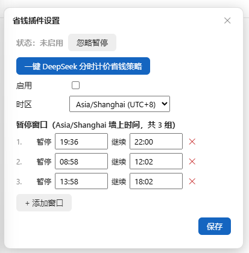

# dsh-save-money

> 🌐 [English](./README.md)

DSH（DeepSeek Harness）**省钱插件** —— 自定义"暂停 / 继续"时间窗口，到点自动**暂停**（不是停止）正在执行的长任务，窗口结束自动恢复。应对大模型 API 的**峰谷分时计价**（如 DeepSeek 高峰 9:00–12:00、14:00–18:00 北京时间，空闲时段半价），也适用于分时电价、带宽错峰等任何"这个时间段不想让机器干活"的场景。

> 状态：✅ 已实现，持续维护。

## 界面一览



会话头部右上角的彩色状态文字（省钱 · ⚪/🟢/🟡/🔴，颜色随状态变化）是唯一常驻入口，点击展开设置；即将暂停 / 已暂停时，页面顶部会出现提醒横幅（含【停用省钱模式】按钮）。


## 功能一览

- **多组时间窗口**：暂停 / 继续时间自由增删，支持跨午夜（23:00–08:00）、按星期过滤；
- **到点自动暂停**：暂停时刻到达后，正在运行的任务会被安全地"冻住"（进度现场原样保留，不会中断或丢失），窗口结束自动恢复接着跑；**没有任务在跑就不暂停**；
- **暂停期间不发请求（省钱核心）**：暂停窗口内，AI 不会向模型服务发出任何新请求，**不产生任何费用**；窗口结束 / 停用 / 忽略后自动恢复继续，对话上下文和进行中的任务都不受影响。**窗口内 AI 不回复（包括新对话）是预期行为**，想立刻恢复就点「停用省钱模式」或「忽略」按钮（不经 AI，直接生效）；
- **忽略 / 立即恢复**：暂停前可忽略本次暂停，暂停中可立即恢复（设置浮层 / 到点自动）；**浮动横幅上的按钮为【停用省钱模式】**——点击一键停用整个功能（紧急时最快通道）；
- **界面提醒**：顶部浮动横幅（即将暂停浅黄 / 已暂停浅红，含【停用省钱模式】按钮）+ 会话头部**唯一常驻入口**（Session log 旁，"省钱 · 🟢 工作中"彩色状态文字，点击展开设置），颜色随状态实时变化；
- **时区支持**：IANA 时区下拉，浏览器自动探测、失败回退北京时间（+8）；UTC 等价投影校对（北京 09:00 == UTC 01:00）；
- **一键 DeepSeek 策略**：去重追加高峰窗口（**08:58–12:02、13:58–18:02**，暂停提前 2 分钟、继续延后 2 分钟的边界余量），不自动启用，由你决定；旧版无余量窗口一键时自动升级；
- **配置持久化**：所有设置自动落盘到工作区文件 `save-money.config.json`（已 gitignore），浏览器刷新、插件停用再激活后配置依然保留，启动时自动加载并（可选）对账恢复暂停中的目标；
- **辅助定位**：不锁屏、不遮挡、不阻止任何用户操作——只暂停目标的自动续跑，手动交互始终放行。

---

## 安装

DeepSeek Harness 的官方插件形态是**导出 `apply` 的模块 + cordis.yml 挂载**（见 [DSH 官方教程](https://github.com/deepseek-ai/deepseek-harness/blob/main/docs/user/develop/basic/index.md)）。本仓库按该形态提供两种安装路径（推荐），另保留一种动态插件调试形态。

> 前置：已安装 `dsh` CLI（或从 [deepseek-harness 源码](https://github.com/deepseek-ai/deepseek-harness) 检出并用 `pnpm dsh` 运行）。仓库已附带编译产物 `plugin/index.js`，**免构建即可安装**；要用最新代码则先 `npm install` 再重新构建。

### 方式一：`--patch` 快速试用（官方推荐，本地源码加载）

1. （可选）重新构建最新版插件模块——首次克隆需先安装构建依赖：

   ```sh
   npm install          # 首次克隆需要（typescript 等构建依赖）
   npm run prepare      # 一步完成：src/*.ts → dist/*.js → plugin/index.js
   ```

2. 编辑 `cordis.patch.yml`，把 `<REPO_ROOT>` 替换为仓库绝对路径：

   ```yaml
   - insert:
       - id: save-money
         name: '<REPO_ROOT>/plugin/index.js'
   ```

3. 带 overlay 启动：

   ```sh
   dsh web --patch ./cordis.patch.yml
   # 源码运行：pnpm dsh web --patch ./cordis.patch.yml
   ```

   插件随 Web 启动加载；状态入口见 [快速上手](#快速上手)。

### 方式二：bundle 打包 + `dsh plugin add` 正式安装（官方推荐，可分发）

1. 打包成 bundle（`cd plugin` 后 `npm pack` 会自动执行其 `prepare` 构建）：

   ```sh
   npm install          # 首次克隆需要
   cd plugin
   npm pack             # 自动构建 TS 并产出 dsh-save-money-*.tgz
   ```

   `plugin/` 目录就是标准 bundle 结构：`package.json` 声明 `dsh.bundle.patch`，`cordis.patch.yml` 插入插件行，`index.js` 为插件模块。

2. 安装进 profile（首次会以 `@deepseek-ai/dsh-base` 初始化）：

   ```sh
   dsh plugin --profile web add ./dsh-save-money-1.1.0.tgz
   ```

   也可从 git 安装：`dsh plugin --profile web add github:you/dsh-save-money#<sha>`（git 安装需要 `prepare` 构建与 `allowBuilds` 放行，见 [DSH 发布教程](https://github.com/deepseek-ai/deepseek-harness/blob/main/docs/user/develop/basic/publish.md)）。

3. 验证层已挂载后启动：

   ```sh
   dsh --profile web --dump-config   # 应出现 "# == dsh-save-money" 层
   dsh --profile web
   ```

   卸载：`dsh plugin --profile web remove dsh-save-money`。

### 方式三：动态 Cordis 插件（开发 / 调试形态，非官方推荐）

仅用于在单会话内快速迭代（进程重启后消失，配置仍持久化在工作区）：

```text
cordis_define(
  plugin: { kind: "new", idPrefix: "savem" },
  code:   { host: <dist/host.js 内容>, client: <dist/client.js 内容> },
  name:   "save-money",
  purpose: "分时窗口暂停/恢复省钱插件",
)
cordis_run(...)   # Client 半边需要一次授权
```

> 说明：`--patch` 与 bundle 形态目前挂载 **Host 半边**（调度、闸门、目标冻结、工具、RPC、持久化全部在内，功能完整）；Client UI（会话头部状态文字、横幅、设置页）在动态插件形态下提供。正式把 Client 半边 bundle 化是后续工作。

### 配置持久化（所有形态通用）

插件把设置写入**工作区根目录**的 `save-money.config.json`（已被 `.gitignore` 排除，不入库）：启动时自动加载，每次配置变更立即落盘。浏览器刷新只影响动态插件形态的 Client 界面（重新 `cordis_run` 即恢复）；`--patch` / bundle 形态下插件随进程常驻，配置与调度不受刷新影响。

---

## 快速上手

1. 安装并激活后，点击**会话头部右上角**（Session log 旁）的"省钱 · 🟢 工作中"状态文字进入设置（唯一常驻入口）；或从**系统设置页**（侧栏 → 设置 → **省钱插件**）进入；
2. 点击【一键 DeepSeek 分时计价省钱策略】→ 自动补上高峰窗口（**08:58–12:02、13:58–18:02** 北京时间，暂停提前 2 分钟、继续延后 2 分钟留余量）；
3. **勾选「启用」**（一键不自动启用）；
4. 保存窗口设置，插件开始监听：到点自动暂停活跃任务，窗口结束自动恢复。

### 常用入口

| 入口 | 位置 |
| --- | --- |
| 状态文字（唯一常驻入口） | 会话头部右上角（Session log 旁）"省钱 · 🟢 工作中"，点击展开设置浮层 |
| 系统设置页 | 侧栏 → 设置 → 省钱插件 |
| 浮动横幅 | 即将暂停 / 已暂停时顶部胶囊 + **【停用省钱模式】** 按钮（点击直接停用整个功能） |

### 动态工具（Host）

| 工具 | 用途 |
| --- | --- |
| `save_money_status` | 查询状态 / **闸门状态（gate: open\|closed）** / 窗口 / 暂停记录 / UTC 投影 |
| `save_money_configure` | 配置（enabled / timezone / warnMinutes / windows） |
| `save_money_ignore` | 忽略当前窗口或下一个窗口的暂停（同时放行闸门） |
| `save_money_debug_tick` | 开发工具：手动推进状态机 |

---

## 文档与许可

- **仓库结构**：`src/core.ts`（纯逻辑，单测覆盖）/ `src/host.ts` / `src/client.ts`（TypeScript 插件源码，单源）、`tests/`（单元测试，`npm test`）、`scripts/build.js`（TS → JS 插件函数体）、`scripts/typecheck.js`（类型检查）、`scripts/make-plugin.js`（官方形态生成器）、`plugin/`（bundle：`package.json` + `cordis.patch.yml` + `index.js`）、`cordis.patch.yml`（快速试用 overlay）、`package.json` / `tsconfig.json`（构建与类型配置）、`dist/`（构建产物，gitignored）、`save-money.config.json`（运行时配置，gitignored）
- **国际化**：UI 文案在 `src/client.ts` 的 `I18N` 字典（中文 + 英文），语言随浏览器自动检测（`zh*` → 中文，其余 → 英文）
- **许可证**：MIT（见 [`LICENSE`](./LICENSE)）
