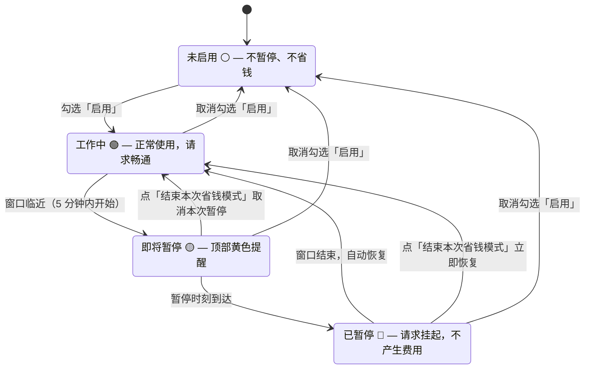

# dsh-save-money

> 🌐 [English](./README.md)

DSH（DeepSeek Harness）**省钱插件** —— 自定义"暂停 / 继续"时间窗口，到点自动**暂停**（不是停止）正在执行的长任务，窗口结束自动恢复。应对大模型 API 的**峰谷分时计价**（如 DeepSeek 高峰 9:00–12:00、14:00–18:00 北京时间，空闲时段半价），也适用于分时电价、带宽错峰等任何"这个时间段不想让机器干活"的场景。

> 状态：✅ 已实现，持续维护。

## 界面一览


会话头部右上角的彩色状态文字（省钱 · ⚪/🟢/🟡/🔴，颜色随状态变化）是唯一常驻入口，点击展开设置；即将暂停 / 已暂停时，页面顶部会出现提醒横幅（含【结束本次省钱模式】按钮）。


## 功能一览

- **多组时间窗口**：暂停 / 继续时间自由增删，支持跨午夜（23:00–08:00）、按星期过滤；
- **到点自动暂停**：暂停时刻到达后，正在运行的任务会被安全地"冻住"（进度现场原样保留，不会中断或丢失），窗口结束自动恢复接着跑；**没有任务在跑就不暂停**；
- **暂停期间不发请求（省钱核心）**：暂停窗口内，AI 不会向模型服务发出任何新请求，**不产生任何费用**；窗口结束 / 停用 / 结束本次窗口后自动恢复继续，对话上下文和进行中的任务都不受影响。**窗口内 AI 不回复（包括新对话）是预期行为**，想立刻恢复就点「结束本次省钱模式」按钮（不经 AI，直接生效）；
- **结束本次省钱模式（一次性，仅当前窗口）**：横幅与设置浮层上的按钮只结束**当前触发的这一个暂停窗口**——已暂停则立即恢复并放行闸门，即将暂停则取消本次暂停；本窗口一直跳过到其继续时间，随后状态自动清除。**下一个窗口（今天或以后）照常生效**，且**不会改动持久化的「启用」开关**——不用担心忘记重新启用导致以后不再省钱；
- **界面提醒**：顶部浮动横幅（即将暂停浅黄 / 已暂停浅红，含【结束本次省钱模式】按钮）+ 会话头部**唯一常驻入口**（Session log 旁，"省钱 · 🟢 工作中"彩色状态文字，点击展开设置），颜色随状态实时变化；
- **时区支持**：IANA 时区下拉，浏览器自动探测、失败回退北京时间（+8）；UTC 等价投影校对（北京 09:00 == UTC 01:00）；
- **一键 DeepSeek 策略**：去重追加高峰窗口（**08:58–12:02、13:58–18:02**，暂停提前 2 分钟、继续延后 2 分钟的边界余量），不自动启用，由你决定；旧版无余量窗口一键时自动升级；
- **配置持久化**：所有设置自动落盘到工作区文件 `save-money.config.json`（已 gitignore），浏览器刷新、插件停用再激活后配置依然保留，启动时自动加载并（可选）对账恢复暂停中的目标；
- **辅助定位**：不锁屏、不遮挡、不阻止任何用户操作——只暂停目标的自动续跑，手动交互始终放行。

## 工作原理



- 暂停窗口开始后，运行中的任务会被冻住（进度原样保留），AI 停止回复——这是正常现象：机器正在为你省钱，窗口结束自动全部恢复；
- 看到黄色「即将暂停」横幅但此刻不想暂停？点**「结束本次省钱模式」**，只取消这一个窗口；
- 已暂停想立刻继续？点**「结束本次省钱模式」**（红色按钮）——立即恢复，只跳过当前窗口，并且**绝不会关闭「启用」**：下一个窗口（今天或以后）照样继续省钱。想让所有窗口重新生效，把「启用」取消勾选再重新勾选即可。

---

## 安装

DeepSeek Harness 的官方插件形态是**导出 `apply` 的模块 + cordis.yml 挂载**（见 [DSH 官方教程](https://github.com/deepseek-ai/deepseek-harness/blob/main/docs/user/develop/basic/index.md)）。本仓库按该形态提供两种安装路径（推荐），另保留一种动态插件调试形态。官方形态安装的是**完整插件**：Host 半边（调度、闸门、目标冻结、工具、HTTP 端点）**和**浏览器界面（状态文字、横幅、设置页）都在，界面自动加载，**不需要 AI 辅助安装**。

### 第 0 步：先让 DSH 跑起来

插件运行在 DSH 里面，所以下面的操作都以 DSH 能运行为前提。两种方式：

**方式 A：安装版 CLI**（最简单，需要 Node.js）：

```sh
npx @deepseek-ai/dsh web        # 启动 Web 界面，默认 http://127.0.0.1:3080
```

**方式 B：源码编译**（例如树莓派；注意 `dsh` 不是全局命令，必须**在 deepseek-harness 目录里面**用 `pnpm dsh`）：

```sh
git clone https://github.com/deepseek-ai/deepseek-harness.git
cd deepseek-harness
pnpm install
pnpm run build
pnpm dsh web                    # 只能在当前目录里用
```

> 源码方式下，**不要**在目录外直接敲 `dsh ...`——它不在 PATH 里（会报 `command not found: dsh`）。一律在 `deepseek-harness` 目录内用 `pnpm dsh ...`（或 `./node_modules/.bin/dsh ...`）。

### 方式一：`--patch` 快速试用（官方推荐，本地源码加载）

适合在本仓库所在机器上直接试用。

1. （可选）重新构建最新版插件模块——首次克隆需先安装构建依赖：

   ```sh
   npm install          # 首次克隆需要（typescript 等构建依赖）
   npm run prepare      # 一步完成：src/*.ts → dist/*.js → plugin/index.js + plugin/client.js
   ```

2. 编辑 `cordis.patch.yml`，把 `<REPO_ROOT>` 替换为仓库绝对路径：

   ```yaml
   - insert:
       - id: save-money
         name: '<REPO_ROOT>/plugin/index.js'
   ```

3. 带 overlay 启动：

   ```sh
   dsh web --patch ./cordis.patch.yml
   # 源码运行：pnpm dsh web --patch ./cordis.patch.yml
   ```

4. 打开浏览器访问打印出的地址（默认 http://127.0.0.1:3080），会话头部右上角即出现"省钱"状态文字。无需其他步骤。

### 方式二：bundle 打包 + `dsh plugin add` 正式安装（官方推荐，可分发，适合另一台机器 / 树莓派）

bundle 是一个很小的 `.tgz`，在一台机器上打出来，装到任何机器上。**目标机器不需要克隆本仓库**——DSH 会把插件装进它自己的 profile（`~/.dsh/profiles/web/node_modules/`）。

**第 1 步——编译并打包**（在任意有本仓库的机器上）：

```sh
cd dsh-save-money
npm install             # 仅首次克隆需要（typescript 开发依赖）
cd plugin
npm pack                # 自动执行 prepare 构建；产出 dsh-save-money-1.2.5.tgz
```

`plugin/` 目录就是标准 bundle 结构：`package.json` 声明 `dsh.bundle.patch` 与 `dsh.client`，`cordis.patch.yml` 插入插件行，`index.js` 为 Host 模块，`client.js` 为浏览器界面 bundle。

**第 2 步——把 tgz 拷到目标机器**（scp / U 盘 / 任意方式）：

```sh
scp dsh-save-money/plugin/dsh-save-money-1.2.5.tgz pi@<树莓派IP>:~/
```

**第 3 步——安装进 profile**（在目标机器的 `deepseek-harness` 目录内执行；首次运行会以 `@deepseek-ai/dsh-base` 初始化 profile）：

```sh
pnpm dsh plugin --profile web add ~/dsh-save-money-1.2.5.tgz
# 安装版 CLI：dsh plugin --profile web add ./dsh-save-money-1.2.5.tgz
```

也可从 git 安装：`dsh plugin --profile web add github:you/dsh-save-money#<sha>`（git 安装需要 `prepare` 构建与 `allowBuilds` 放行，见 [DSH 发布教程](https://github.com/deepseek-ai/deepseek-harness/blob/main/docs/user/develop/basic/publish.md)）。

**第 4 步——验证层已挂载，然后启动**（**必须完全重启 DSH**，不是刷新页面）：

```sh
pnpm dsh --profile web --dump-config   # 末尾应出现 "# == dsh-save-money" 层
pnpm dsh --profile web                 # 若已有实例在跑，先 Ctrl+C 停掉
```

**第 5 步——打开浏览器**访问 http://127.0.0.1:3080 并**强制刷新**（Ctrl+Shift+R）。会话头部出现"省钱"状态文字，点击进入设置；也可在对话中让 AI 执行 `save_money_status` 确认插件已加载。

**升级到新版本**（例如 1.2.4 → 1.2.5）：

```sh
# 在打包机上：
cd dsh-save-money && git pull && cd plugin && npm pack    # 产出新的 dsh-save-money-<新版本>.tgz
scp dsh-save-money/plugin/dsh-save-money-1.2.5.tgz pi@<树莓派IP>:~/

# 在目标机器上：
pnpm dsh plugin --profile web remove dsh-save-money
pnpm dsh plugin --profile web add ~/dsh-save-money-1.2.5.tgz
pnpm dsh --profile web                # 重启，然后强制刷新浏览器
```

你的设置会保留（存在 `save-money.config.json` 里，卸载/重装不会动它）。

**卸载：**

```sh
pnpm dsh plugin --profile web remove dsh-save-money
```

### 方式三：动态 Cordis 插件（开发 / 调试形态，非官方推荐）

仅用于在单会话内快速迭代（进程重启后消失，配置仍持久化在工作区）：

```text
cordis_define(
  plugin: { kind: "new", idPrefix: "savem" },
  code:   { host: <dist/host.js 内容>, client: <dist/client.js 内容> },
  name:   "save-money",
  purpose: "分时窗口暂停/恢复省钱插件",
)
cordis_run(...)   # Client 半边需要一次授权
```

### 配置持久化（所有形态通用）

插件把设置写入**工作区根目录**的 `save-money.config.json`（已被 `.gitignore` 排除，不入库）：启动时自动加载，每次配置变更立即落盘。所有安装形态下界面都在页面加载时由浏览器挂载，刷新后插件与设置保持正常；动态插件形态额外随进程存在（重启后重新 `cordis_run` 即恢复）。

### 故障排查

| 现象 | 原因与解决 |
| --- | --- |
| `zsh: command not found: dsh` / `dsh: command not found` | 你用的是源码方式运行 DSH——`dsh` 只在 `deepseek-harness` 目录内可用（`pnpm dsh ...` 或 `./node_modules/.bin/dsh`），不要在目录外使用裸 `dsh`。 |
| 插件加载失败，报 `ReferenceError: harness is not defined` | 使用的是 **v1.2.2 之前**的构建（官方形态在 v1.2.2 修复）。重新构建（`npm run prepare`）、重新打包安装后重启。 |
| 安装后没有状态文字 / 横幅 / 设置页 | **完全重启 DSH**（Ctrl+C 停掉再启动）并**强制刷新浏览器**（Ctrl+Shift+R）——界面在启动时发现。若仍不出现，说明是 **v1.2.4 之前**的构建——请升级。 |
| 界面显示了，但**「启用」勾选不上 / 设置点不动** | 使用的是 **v1.2.5 之前**的构建——旧版插件可能早于 Web 服务就绪，界面请求到达不了插件。升级到 v1.2.5 及以上并重启。 |
| 配置文件在哪？ | 工作区根目录的 `save-money.config.json`（DSH 启动目录或会话工作区）。删除它即恢复默认设置。 |

---

## 快速上手

> 以下步骤适用于所有安装方式——官方形态（`--patch` / bundle）与动态插件形态（方式三）一样自带设置界面。也可在对话中通过工具（`save_money_configure`、`save_money_status`）配置。

1. 安装并激活后，点击**会话头部右上角**（Session log 旁）的"省钱 · 🟢 工作中"状态文字进入设置（唯一常驻入口）；或从**系统设置页**（侧栏 → 设置 → **省钱插件**）进入；
2. 点击【一键 DeepSeek 分时计价省钱策略】→ 自动补上高峰窗口（**08:58–12:02、13:58–18:02** 北京时间，暂停提前 2 分钟、继续延后 2 分钟留余量）；
3. **勾选「启用」**（一键不自动启用）；
4. 保存窗口设置，插件开始监听：到点自动暂停活跃任务，窗口结束自动恢复。

### 常用入口

| 入口 | 位置 |
| --- | --- |
| 状态文字（唯一常驻入口） | 会话头部右上角（Session log 旁）"省钱 · 🟢 工作中"，点击展开设置浮层 |
| 系统设置页 | 侧栏 → 设置 → 省钱插件 |
| 浮动横幅 | 即将暂停 / 已暂停时顶部胶囊 + **【结束本次省钱模式】** 按钮（一次性：只结束当前窗口，后续窗口不受影响） |

### 动态工具（Host）

| 工具 | 用途 |
| --- | --- |
| `save_money_status` | 查询状态 / **闸门状态（gate: open\|closed）** / 窗口 / 暂停记录 / UTC 投影 |
| `save_money_configure` | 配置（enabled / timezone / warnMinutes / windows） |
| `save_money_end_window` | 结束当前活动窗口的省钱模式（一次性、内存态）：立即恢复 / 取消即将到来的暂停；后续窗口照常生效 |
| `save_money_debug_tick` | 开发工具：手动推进状态机 |

---

## 文档与许可

- **仓库结构**：`src/core.ts`（纯逻辑，单测覆盖）/ `src/host.ts` / `src/client.ts`（TypeScript 插件源码，单源）、`tests/`（单元测试，`npm test`）、`scripts/build.js`（TS → JS 插件函数体）、`scripts/typecheck.js`（类型检查）、`scripts/make-plugin.js`（官方 bundle 生成器）、`plugin/`（bundle：`package.json` + `cordis.patch.yml` + `index.js` + `client.js`）、`cordis.patch.yml`（快速试用 overlay）、`package.json` / `tsconfig.json`（构建与类型配置）、`dist/`（构建产物，gitignored）、`save-money.config.json`（运行时配置，gitignored）
- **国际化**：UI 文案在 `src/client.ts` 的 `I18N` 字典（10 种语言：zh、zh-TW、en、de、fr、es、it、pt、ja、ko），语言随浏览器自动检测，也可手动选择（自动 + 10 种），选择随配置持久化
- **许可证**：MIT（见 [`LICENSE`](./LICENSE)）
