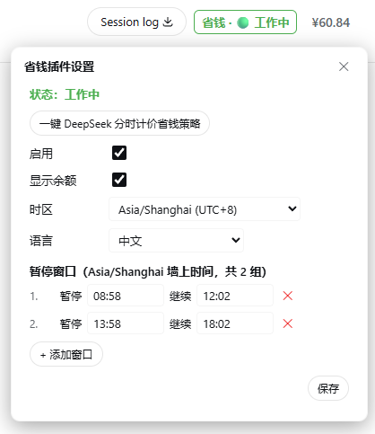
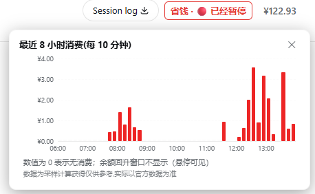
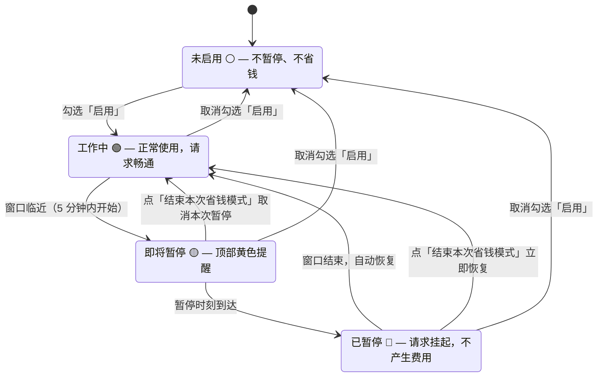

# dsh-save-money

> 🌐 [English](./README.md)

DSH（DeepSeek Harness）**省钱插件** —— 自定义"暂停 / 继续"时间窗口，到点自动**暂停**（不是停止）正在执行的长任务，窗口结束自动恢复。应对大模型 API 的**峰谷分时计价**（如 DeepSeek 高峰 9:00–12:00、14:00–18:00 北京时间，空闲时段半价），也适用于分时电价、带宽错峰等任何"这个时间段不想让机器干活"的场景。

> 状态：✅ 已实现，持续维护。

## 界面一览



会话头部右上角的彩色状态文字（省钱 · ⚪/🟢/🟡/🔴，颜色随状态变化）是唯一常驻入口，点击展开设置；即将暂停 / 已暂停时，页面顶部会出现提醒横幅（含【结束本次省钱模式】按钮）。

开启「显示余额」后，头部状态文字旁会显示 DeepSeek 官方账户余额；**点击余额**弹出最近 8 小时消费柱形图：



柱形图每 10 分钟一根柱，X 轴为整点小时、Y 轴为金额关键点刻度（≤5 个、带网格线），悬停可看每根柱的精确时间窗口与金额；无本环境活动的下降窗口以警示色标注（可能来自其他设备）。


## 功能一览

- **多组时间窗口**：暂停 / 继续时间自由增删，支持跨午夜（23:00–08:00）、按星期过滤；
- **到点自动暂停**：暂停时刻到达后，正在运行的任务会被安全地"冻住"（进度现场原样保留，不会中断或丢失），窗口结束自动恢复接着跑；**没有任务在跑就不暂停**；
- **暂停期间不发请求（省钱核心）**：暂停窗口内，AI 不会向模型服务发出任何新请求，**不产生任何费用**；窗口结束 / 停用 / 结束本次窗口后自动恢复继续，对话上下文和进行中的任务都不受影响。**窗口内 AI 不回复（包括新对话）是预期行为**，想立刻恢复就点「结束本次省钱模式」按钮（不经 AI，直接生效）；
- **按模型档位决定是否省钱**：可以按模型档位选择哪些在窗口内暂停。设置面板用两行紧凑布局——**官方 API：flash / pro**、**opencode go·zen API：flash / pro**，共 4 个开关。勾选 = 暂停（省钱）；不勾选 = **豁免**（窗口内也照常放行）。默认勾选官方 flash+pro、opencode 豁免；你的改动持久化保存、绝不重置。任何无法识别的模型（旧名 `chat`/`reasoner`、其他第三方、其他任何模型）一律豁免——永远不会阻塞你的请求；
- **结束本次省钱模式（一次性，仅当前窗口）**：横幅与设置浮层上的按钮只结束**当前触发的这一个暂停窗口**——已暂停则立即恢复并放行闸门，即将暂停则取消本次暂停；本窗口一直跳过到其继续时间，随后状态自动清除。**下一个窗口（今天或以后）照常生效**，且**不会改动持久化的「启用」开关**——不用担心忘记重新启用导致以后不再省钱；
- **界面提醒**：顶部浮动横幅（即将暂停浅黄 / 已暂停浅红，含【结束本次省钱模式】按钮）+ 会话头部**唯一常驻入口**（Session log 旁，"省钱 · 🟢 工作中"彩色状态文字，点击展开设置），颜色随状态实时变化；
- **时区支持**：IANA 时区下拉，浏览器自动探测、失败回退北京时间（+8）；UTC 等价投影校对（北京 09:00 == UTC 01:00）；
- **一键 DeepSeek 策略**：去重追加高峰窗口（**08:58–12:02、13:58–18:02**，暂停提前 2 分钟、继续延后 2 分钟的边界余量），不自动启用，由你决定；旧版无余量窗口一键时自动升级；
- **配置持久化**：所有设置自动落盘到工作区文件 `save-money.config.json`（已 gitignore），浏览器刷新、插件停用再激活后配置依然保留，启动时自动加载并（可选）对账恢复暂停中的目标；
- **账户余额显示（可选）**：勾选设置里的「显示余额」后，头部状态文字旁显示 DeepSeek 官方账户余额（货币符号自动识别、颜色随亮暗主题自适应）。默认关闭。配置了多个模型源（DeepSeek 官方 + 硅基流动、中转等）时，余额**跟随实际使用的模型**：最近一次真实请求跑在官方 DeepSeek 上就显示,否则隐藏（已采样的消费统计不会清除，切回 DeepSeek 后余额立即恢复显示）；
- **消费统计**：开启余额显示后，后端每 5 分钟采样一次余额（288 个点覆盖最近 24 小时）。把鼠标悬停在余额上，即可看到**最近 1 小时 / 10 分钟 / 24 小时消费了多少钱**（充值、退款导致的余额回升显示为「+金额」）；
- **消费柱形图（最近 8 小时、每 10 分钟一根）**：点击余额数字弹出图表。**外部消费归因**——本环境无任何模型活动但余额下降的窗口以**警示色**标记（悬停提示"本窗口无本环境活动，变动可能来自其他环境"），不会当成本环境消费，所以在其他机器用同一个 key 也不会出现"1 秒消费爆炸"的惊吓。**余额回升（充值/退款）不画柱、不拉伸 Y 轴**——轴只保留消费方向；被隐藏的回升窗口悬停时标注"余额回升（充值/退款），未计入消费分析"；
- **余额历史持久化**：采样历史自动保存到 `~/.dsh/dsh-save-money-balance.json`（账户级、跨项目共享），插件更新/重启不丢失。文件以 API key 指纹标识——**更换 key 自动作废旧历史**；
- **辅助定位**：不锁屏、不遮挡、不阻止任何用户操作——只暂停目标的自动续跑，手动交互始终放行。

## 工作原理



- 暂停窗口开始后，运行中的任务会被冻住（进度原样保留），AI 停止回复——这是正常现象：机器正在为你省钱，窗口结束自动全部恢复；
- 看到黄色「即将暂停」横幅但此刻不想暂停？点**「结束本次省钱模式」**，只取消这一个窗口；
- 已暂停想立刻继续？点**「结束本次省钱模式」**（红色按钮）——立即恢复，只跳过当前窗口，并且**绝不会关闭「启用」**：下一个窗口（今天或以后）照样继续省钱。想让所有窗口重新生效，把「启用」取消勾选再重新勾选即可。

---

## 安装

DeepSeek Harness 的官方插件形态是**导出 `apply` 的模块 + cordis.yml 挂载**（见 [DSH 官方教程](https://github.com/deepseek-ai/deepseek-harness/blob/main/docs/user/develop/basic/index.md)）。既可以从 **npm** 安装（一行命令，推荐），也可以从本仓库构建（下面的三种方式：`--patch` 快速试用、bundle 打包分发、link + HMR 热重载开发调试形态）。所有官方形态安装的都是**完整插件**：Host 半边（调度、闸门、目标冻结、工具、HTTP 端点）**和**浏览器界面（状态文字、横幅、设置页）都在，界面自动加载，**不需要 AI 辅助安装**。


### npm方式安装：从 npm 安装（推荐）

插件已发布到 npm，推荐使用以下方式安装。

#### 首次安装

执行一行命令即可安装到 Web 环境：

```sh
npx @deepseek-ai/dsh plugin --profile web add dsh-save-money

```

#### 插件删除

```sh
npx @deepseek-ai/dsh plugin --profile web remove dsh-save-money
```

安装完成后，**完全重启 DSH**（Ctrl+C 停掉再启动）并**强制刷新浏览器**（Ctrl+Shift+R），即可在会话头部右上角看到“省钱”状态文字。


### 源码安装

以目录是 `~/app/` 为例（每一步都假设上一步已成功）：

```sh
cd ~/app/

git clone https://github.com/zhu168/dsh-save-money.git

cd dsh-save-money
npm install

cd plugin
npm pack                    # 自动执行构建；产出插件包

ls                          # 查看插件打包文件名，比如 dsh-save-money-1.4.3.tgz

cd ~/app/deepseek-harness   # 这里改成你的 harness 目录（没有就先 clone，见下方「第 0 步」）

pnpm dsh plugin --profile web remove dsh-save-money   # 如果之前安装过，这一步是卸载；没安装过可以跳过

pnpm dsh plugin --profile web add ../dsh-save-money/plugin/dsh-save-money-1.4.3.tgz   # 文件名按上面 ls 的实际输出

pnpm dsh --profile web      # 启动 DeepSeek Harness，可以看到本插件在右上角了
```

> 两处注意：① 第 6 行的 tgz 文件名以 `ls` 的实际输出为准（`1.4.0` 只是示例）；② 若你的 harness 是用 npx 启动的，把上面所有 `pnpm dsh` 换成 `npx @deepseek-ai/dsh`（安装命令同理）。

### 第 0 步：先让 DSH 跑起来

插件运行在 DSH 里面，所以下面的操作都以 DSH 能运行为前提。两种方式：

**方式 A：安装版 CLI**（最简单，需要 Node.js）：

```sh
npx @deepseek-ai/dsh web        # 启动 Web 界面，默认 http://127.0.0.1:3080
```

**方式 B：源码编译**（例如树莓派；注意 `dsh` 不是全局命令，必须**在 deepseek-harness 目录里面**用 `pnpm dsh`）：

```sh
git clone https://github.com/deepseek-ai/deepseek-harness.git
cd deepseek-harness
pnpm install
pnpm run build
pnpm dsh web                    # 只能在当前目录里用
```

> 源码方式下，**不要**在目录外直接敲 `dsh ...`——它不在 PATH 里（会报 `command not found: dsh`）。一律在 `deepseek-harness` 目录内用 `pnpm dsh ...`（或 `./node_modules/.bin/dsh ...`）。

### 方式一：`--patch` 快速试用（官方推荐，本地源码加载）

适合在本仓库所在机器上直接试用。

1. （可选）重新构建最新版插件模块——首次克隆需先安装构建依赖：

   ```sh
   npm install          # 首次克隆需要（typescript 等构建依赖）
   npm run prepare      # 一步完成：src/*.ts → dist/*.js → plugin/index.js + plugin/client.js
   ```

2. 编辑 `cordis.patch.yml`，把 `<REPO_ROOT>` 替换为仓库绝对路径（整个文件只有这一处，用编辑器的「全部替换」最快）：

   ```yaml
   - insert:
       - id: save-money
         name: '<REPO_ROOT>/plugin/index.js'
   ```

   示例——Windows：`name: 'D:/git/github/dsh-save-money/plugin/index.js'`；Linux / macOS / 树莓派：`name: '/home/pi/dsh-save-money/plugin/index.js'`。

   > 若你的 profile 已经通过 bundle / link 方式装过本插件，请跳过方式一（叠加 `--patch` 会重复注册插件）。

3. 带 overlay 启动：

   ```sh
   dsh web --patch ./cordis.patch.yml               # 已全局安装 dsh
   npx @deepseek-ai/dsh web --patch ./cordis.patch.yml  # npx 启动（第 0 步-方式 A）
   # 源码运行：pnpm dsh web --patch ./cordis.patch.yml
   ```

4. 打开浏览器访问打印出的地址（默认 http://127.0.0.1:3080），会话头部右上角即出现"省钱"状态文字。无需其他步骤。

### 方式二：bundle 打包 + `dsh plugin add` 正式安装（官方推荐，可分发，适合另一台机器 / 树莓派）

bundle 是一个很小的 `.tgz`，在一台机器上打出来，装到任何机器上。**目标机器不需要克隆本仓库**——DSH 会把插件装进它自己的 profile（`~/.dsh/profiles/web/node_modules/`）。

**第 1 步——编译并打包**（在任意有本仓库的机器上）：

```sh
cd dsh-save-money
npm install             # 仅首次克隆需要（typescript 开发依赖）
cd plugin
npm pack                # 自动执行 prepare 构建；产出 dsh-save-money-1.4.3.tgz
```

`plugin/` 目录就是标准 bundle 结构：`package.json` 声明 `dsh.bundle.patch` 与 `dsh.client`，`cordis.patch.yml` 插入插件行，`index.js` 为 Host 模块，`client.js` 为浏览器界面 bundle。

**第 2 步——把 tgz 拷到目标机器**（scp / U 盘 / 任意方式；下面命令在打包机上、仓库目录的**上一级**执行，路径按实际调整）：

```sh
scp dsh-save-money/plugin/dsh-save-money-1.4.3.tgz pi@<树莓派IP>:~/
```

**第 3 步——安装进 profile**（在目标机器上执行；首次运行会自动以 `@deepseek-ai/dsh-base` 初始化 profile）：

```sh
# 源码运行 DSH（在 deepseek-harness 目录内）：
pnpm dsh plugin --profile web add ~/dsh-save-money-1.4.3.tgz
# npx 启动（README「第 0 步-方式 A」）或已全局安装 dsh：任意目录都可执行
npx @deepseek-ai/dsh plugin --profile web add ~/dsh-save-money-1.4.3.tgz
```

> 两种命令效果一样，都是把 tgz 装进 `~/.dsh/profiles/web/node_modules/`。选你启动 DSH 用的那一种即可。

也可从 git 安装：`dsh plugin --profile web add github:you/dsh-save-money#<sha>`（git 安装需要 `prepare` 构建与 `allowBuilds` 放行，见 [DSH 发布教程](https://github.com/deepseek-ai/deepseek-harness/blob/main/docs/user/develop/basic/publish.md)）。

**第 4 步——验证层已挂载，然后启动**（**必须完全重启 DSH**，不是刷新页面）：

```sh
pnpm dsh --profile web --dump-config   # 输出中应能看到 dsh-save-money 的层（插件行）
pnpm dsh --profile web                 # 若已有实例在跑，先 Ctrl+C 停掉
```

**第 5 步——打开浏览器**访问 http://127.0.0.1:3080 并**强制刷新**（Ctrl+Shift+R）。会话头部出现"省钱"状态文字，点击进入设置；也可在对话中让 AI 执行 `save_money_status` 确认插件已加载。

**升级到新版本**（例如 1.3.0 → 1.4.0）：

> 下面用 `pnpm dsh` 写的命令，npx 启动的用户把 `pnpm dsh` 换成 `npx @deepseek-ai/dsh` 即可。

```sh
# 在打包机上：
cd dsh-save-money && git pull && cd plugin && npm pack    # 产出新的 dsh-save-money-<新版本>.tgz
scp dsh-save-money/plugin/dsh-save-money-1.4.3.tgz pi@<树莓派IP>:~/

# 在目标机器上：
pnpm dsh plugin --profile web remove dsh-save-money
pnpm dsh plugin --profile web add ~/dsh-save-money-1.4.3.tgz
pnpm dsh --profile web                # 重启，然后强制刷新浏览器
```

你的设置会保留（存在 `save-money.config.json` 里，卸载/重装不会动它）。

**卸载：**

```sh
pnpm dsh plugin --profile web remove dsh-save-money
```

### 方式三：开发调试（本仓库开发时实际使用：link 安装 + HMR 热重载）

改完代码立刻生效、**不需要重启 DSH**、也不用打包 tgz——这是本插件开发时用的形态：`dsh plugin add link:` 把 `plugin/` 目录直接链接进 profile，再配一个 `cordis-plugin-hmr` 热重载插件监听构建产物。保存源码 → `npm run prepare` → 运行中的 DSH 自动换上新插件，浏览器强制刷新看界面。

**一次性准备（在开发机上）：**

1. 构建并链接安装：

   ```sh
   cd dsh-save-money
   npm run prepare                          # src/*.ts → plugin/index.js + plugin/client.js
   pnpm dsh plugin --profile web add link:D:/git/github/dsh-save-money/plugin   # 换成你的仓库绝对路径
   ```

2. 配置热重载：编辑 `~/.dsh/profiles/web/cordis.patch.yml`（没有就新建），把下面的 `root` 换成你的仓库 `plugin` 目录绝对路径：

   ```yaml
   - insert:
       - id: save-money-hmr
         name: '@deepseek-ai/cordis-plugin-hmr'
         config:
           root: ['D:/git/github/dsh-save-money/plugin']
           ignored: ['**/node_modules', '**/.*']
           debounce: 100
   ```

3. 启动 DSH（`pnpm dsh web` / `npx @deepseek-ai/dsh web`）并打开浏览器（默认 http://127.0.0.1:3080）。

**日常开发循环：**

```sh
# 改完 src/*.ts 后执行一次：
npm run prepare        # 重新构建 → 写入 plugin/index.js + client.js
```

DSH 会在约 0.1 秒内自动热替换插件（终端出现 `[hmr]` 日志），**不用重启**；**浏览器界面需要强制刷新（Ctrl+Shift+R）**才能看到 client 侧改动。

> 注意：`link:` 与方式二的 bundle 安装互斥——之前用 bundle 装过的话，先 `pnpm dsh plugin --profile web remove dsh-save-money` 再 `add link:`。

### 配置持久化（所有形态通用）

插件把设置写入 `save-money.config.json`（已被 `.gitignore` 排除，不入库）：启动时自动加载，每次配置变更立即落盘。配置文件的位置按以下顺序自动查找（**第一个存在配置文件的目录胜出**）：

1. `~/.dsh/save-money-config-path.json` 指针文件记录的目录（上次实际使用的位置，重启后稳定恢复）；
2. 当前会话的工作区目录；
3. 所有以 `dsh-save-money` 结尾的会话工作区目录（多个时取最新的）；
4. DSH 启动目录本身（`process.cwd()`，官方安装形态）；
5. DSH 启动目录的**同级** `dsh-save-money` 目录（即 README 安装教程的布局：`~/app/deepseek-harness` 与 `~/app/dsh-save-money` 并排）；
6. 最后兜底：`sandboxPolicy.workspaceRoot`（DSH 安装目录）。

全新安装（任何位置都没有配置文件）时，插件会优先把配置写到**仓库目录**（第 4 / 5 步命中的 `dsh-save-money` 目录），而不是污染 DSH 安装目录；写入成功后自动在 `~/.dsh/` 记录指针，此后重启都会从同一位置加载。删除配置文件即恢复默认设置。

### 故障排查

| 现象 | 原因与解决 |
| --- | --- |
| `zsh: command not found: dsh` / `dsh: command not found` | 你用的是源码方式运行 DSH——`dsh` 只在 `deepseek-harness` 目录内可用（`pnpm dsh ...` 或 `./node_modules/.bin/dsh`），不要在目录外使用裸 `dsh`。 |
| 插件加载失败，报 `ReferenceError: harness is not defined` | 使用的是 **v1.2.2 之前**的构建（官方形态在 v1.2.2 修复）。重新构建（`npm run prepare`）、重新打包安装后重启。 |
| 安装后没有状态文字 / 横幅 / 设置页 | **完全重启 DSH**（Ctrl+C 停掉再启动）并**强制刷新浏览器**（Ctrl+Shift+R）——界面在启动时发现。若仍不出现，说明是 **v1.2.4 之前**的构建——请升级。 |
| 界面显示了，但**「启用」勾选不上 / 设置点不动** | 使用的是 **v1.2.5 之前**的构建——旧版插件可能早于 Web 服务就绪，界面请求到达不了插件。升级到 v1.2.5 及以上并重启。 |
| 配置文件在哪？ | 按上述 6 级候选自动解析（优先会话工作区 / 仓库目录，指针文件 `~/.dsh/save-money-config-path.json` 记录上次位置）。删除它即恢复默认设置。 |

---

## 快速上手

> 以下步骤适用于所有安装方式——方式一 / 方式二 / 方式三都一样自带设置界面。也可在对话中通过工具（`save_money_configure`、`save_money_status`）配置。

1. 安装并激活后，点击**会话头部右上角**（Session log 旁）的"省钱 · 🟢 工作中"状态文字进入设置（唯一常驻入口）；或从**系统设置页**（侧栏 → 设置 → **省钱插件**）进入；
2. 点击【一键 DeepSeek 分时计价省钱策略】→ 自动补上高峰窗口（**08:58–12:02、13:58–18:02** 北京时间，暂停提前 2 分钟、继续延后 2 分钟留余量）；
3. **勾选「启用」**（一键不自动启用）；
4. 保存窗口设置，插件开始监听：到点自动暂停活跃任务，窗口结束自动恢复。

### 常用入口

| 入口 | 位置 |
| --- | --- |
| 状态文字（唯一常驻入口） | 会话头部右上角（Session log 旁）"省钱 · 🟢 工作中"，点击展开设置浮层 |
| 系统设置页 | 侧栏 → 设置 → 省钱插件 |
| 浮动横幅 | 即将暂停 / 已暂停时顶部胶囊 + **【结束本次省钱模式】** 按钮（一次性：只结束当前窗口，后续窗口不受影响） |

### 动态工具（Host）

| 工具 | 用途 |
| --- | --- |
| `save_money_status` | 查询状态 / **闸门状态（gate: open\|closed）** / 窗口 / 暂停记录 / UTC 投影 |
| `save_money_configure` | 配置（enabled / timezone / warnMinutes / windows） |
| `save_money_end_window` | 结束当前活动窗口的省钱模式（一次性、内存态）：立即恢复 / 取消即将到来的暂停；后续窗口照常生效 |
| `save_money_debug_tick` | 开发工具：手动推进状态机 |

---

## 文档与许可

- **仓库结构**：`src/core.ts`（纯逻辑，单测覆盖）/ `src/host.ts` / `src/client.ts`（TypeScript 插件源码，单源）、`tests/`（单元测试，`npm test`）、`scripts/build.js`（TS → JS 插件函数体）、`scripts/typecheck.js`（类型检查）、`scripts/make-plugin.js`（官方 bundle 生成器）、`plugin/`（bundle：`package.json` + `cordis.patch.yml` + `index.js` + `client.js`）、`cordis.patch.yml`（快速试用 overlay）、`package.json` / `tsconfig.json`（构建与类型配置）、`dist/`（构建产物，gitignored）、`save-money.config.json`（运行时配置，gitignored）
- **国际化**：UI 文案在 `src/client.ts` 的 `I18N` 字典（10 种语言：zh、zh-TW、en、de、fr、es、it、pt、ja、ko），语言随浏览器自动检测，也可手动选择（自动 + 10 种），选择随配置持久化
- **许可证**：MIT（见 [`LICENSE`](./LICENSE)）
